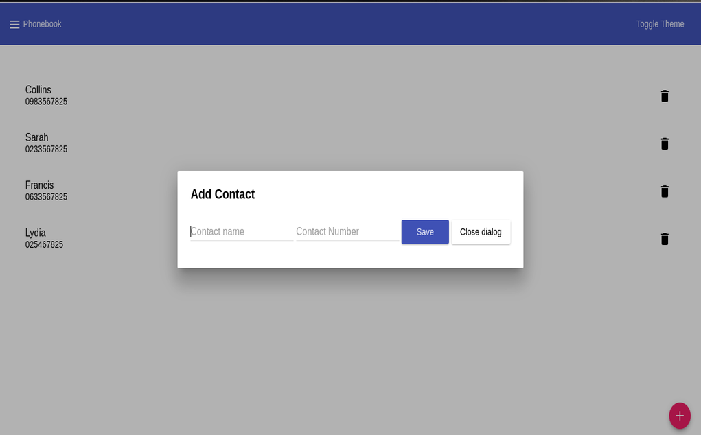

# Phonebook
[Visit here to see a Working Demo](https://mysterious-falls-96381.herokuapp.com/)
> ## Phonebook with Angular Material Design
> Add and Delete Contacts

## Development server

Run `ng serve` for a dev server. Navigate to `http://localhost:4200/`. The app will automatically reload if you change any of the source files.

## Build

Run `ng build` to build the project. The build artifacts will be stored in the `dist/` directory. Use the `-prod` flag for a production build.
